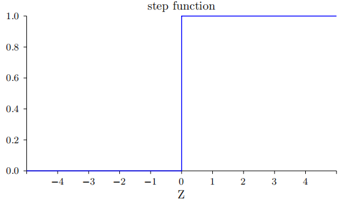
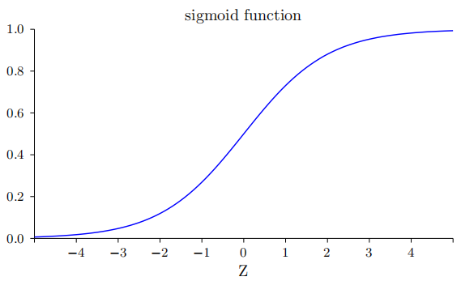
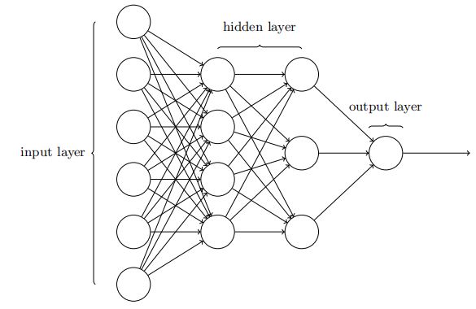

# 神经网络基本构成

​		本文介绍神经网络的基本构成，从组成神经网络的最小单位——神经元开始介绍，到由神经元组成的神经网络。

## 神经元

神经元是神经网络的基本组成单位，你需要知道一个神经元在做一个什么样的工作，才能很容易的理解整个神经网络在做什么工作，因此从两种基本的神经元——感知机和S型神经元开始介绍。

### 感知机

感知器的函数形式：

其中wi表示第i个神经元的权重，可以理解为第i个神经元的重要程度。threshold表示阈值。这个函数可以转化为以下的形式：

感知器函数图像：

### S型神经元

S型神经元的函数：

其中z=wx+b

S型神经元函数图像：

### 感知器与S型神经元的异同

由感知器与S型神经元的函数形式可以看出，感知器只能输出0、1，而S型神经元可以输出0~1之间的任意值.

## 神经网络

下图是一个神经网络（多层感知器或MLP）的结构图：

该神经网络分为3层：

输入层：输入层的设计原理是数据有多少就有多少输入神经元，例如输入图像为28*28，则输入神经元的个数就是784=28x28.

隐藏层：隐藏层的神经元每一层的个数和层数按道理来说越多对训练数据的学习能力越好，但并不是说对测试数据的表现就越好，其中有一个过拟合的问题，所以还有很多更复杂的问题要学习理解，稍后再说。

输出层：输出层的设计一般是有多少类别就有多少输出神经元，例如手写手写数字识别有0~9十个类别，所以就有10个输出神经元。

# 结语

​		到此，一个神经网络的基本组成就介绍完了，但这仅仅是开始，还有很多复杂的问题要解决，而现在已经有了很多解决方法需要我们学习探索。

